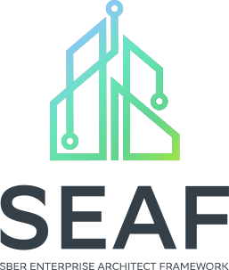
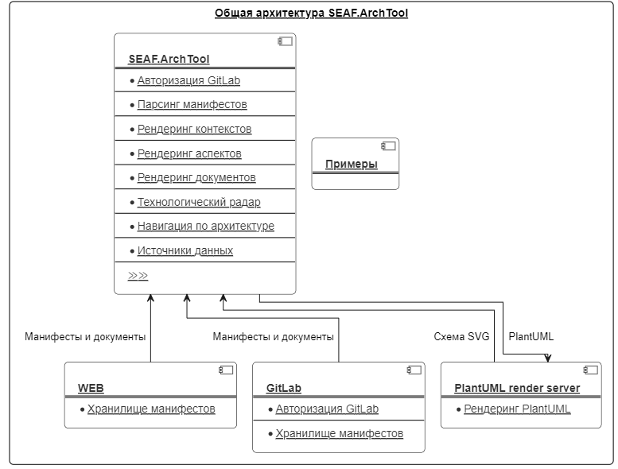
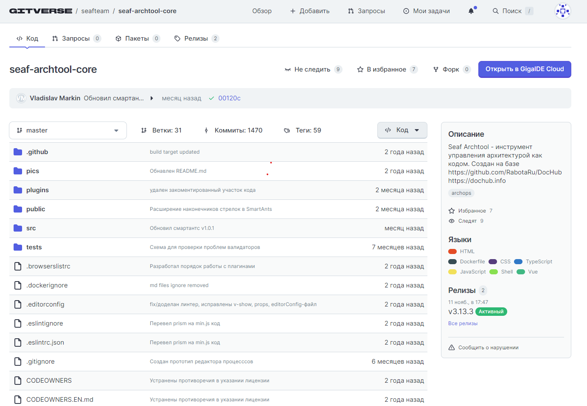
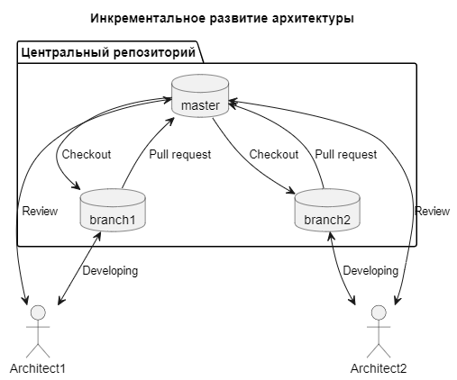
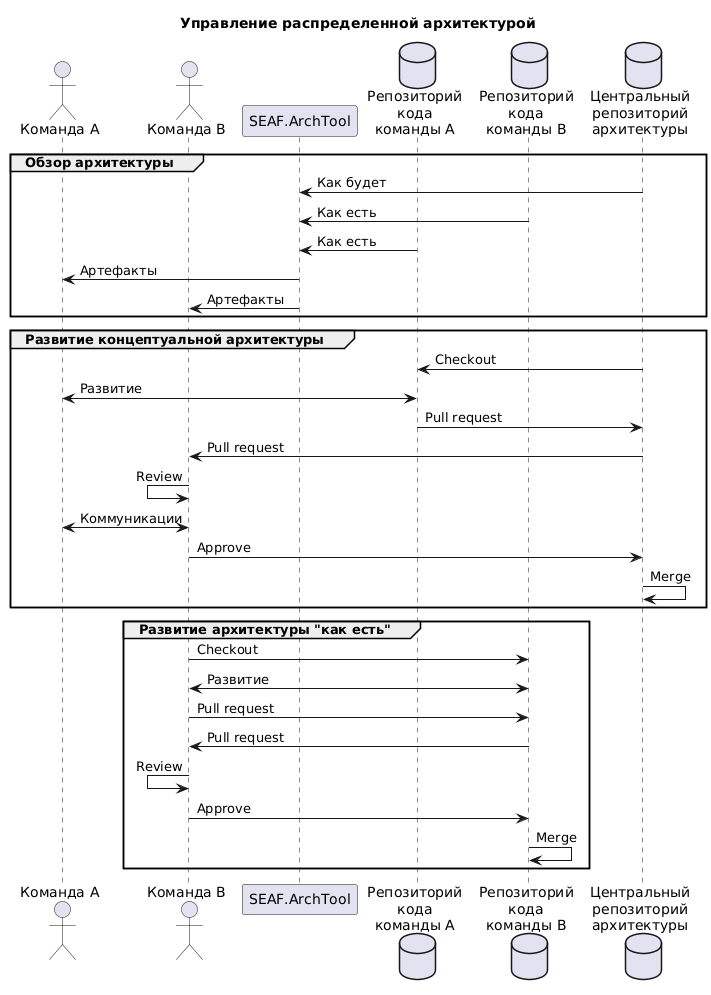
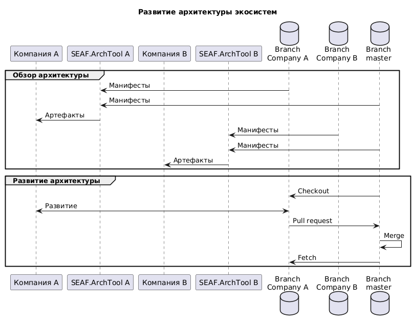
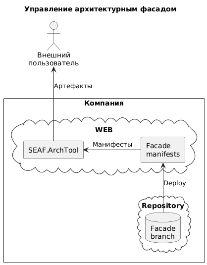
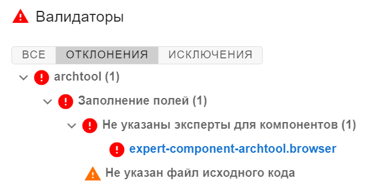

# SEAF.ArchTool
#### Добро пожаловать в SEAF.ArchTool — решение для управления цифровой архитектурой.



[Быстрый старт 🚀](#быстрый-старт) • [Cписок репозиториев 📋](#список-репозиториев)

### Применение
SEAF.ArchTool — продукт, предназначенный для выполнения следующих задач:
- Описание цифровой архитектуры. Мы считаем, что достичь ее можно описывая архитектуру кодом.
- Повышение архитектурной зрелости компании группы "Сбер".
- Экспертиза архитектурных решений, обеспечивая тем самым соответствие этих решений установленным стандартам и стратегическим направлениям банка.

#### Наш подход включает:
1. Исследование кейсов, возникающих перед бизнесами и IT, формирование выверенных примеров описания и управления архитектурой (разработка и экспертиза артефактов), выявление лучших практик, обучение, референс, сопровождение и консалтинг.
2. Архитектурную работу c применением SEAF в организациях Группы Сбер, Банке или внешней организации-партнере, приносящую ценность бизнесу, поддерживаемую Сообществом и демонстрирующую во внешнюю среду успешную историю развития участника Сообщества.
3. Разработку и внедрение архитектурных стандартов — мы создаем и тиражируем стандарты среди ДЗО, что значительно повышает зрелость информационных технологий.
4. Проведение контроля архитектур на соответствие установленным стандартам с целью обеспечить оптимальность принимаемых решений.
5. Развитие сообщества архитекторов, что позволяет обмениваться опытом и иными ресурсами между ДЗО.

Мы используем практические кейсы, которые доказали, что целостный и системный подход к архитектуре способствует повышению качества принимаемых решений. Путем управления архитектурой и внедрения стандартов, мы не только повышаем зрелость информационных технологий, но и создаем условия для обмена опытом среди участников Сообщества.
### Инструмент
SEAF.ArchTool - инструмент управления архитектурой как кодом. Создан на базе https://github.com/DocHubTeam/DocHub.
Документация: https://dochub.info.

#### Векторы SEAF.ArchTool, отличные от Dochub
- Поддержка цифровых архитектурных шаблонов и фреймворков, разрабатываемых в Сбере (SEAF, КА ДЗО, Ассессменты и др.)
- Поддержка Enterprise режимов использования инструмента SEAF.Archtool (бекэнд режим, в k8s, ролевая модель и т.п.)
- Обеспечение уровня безопасности продукта (обязательные проверки на уязвимости инструментами Сбера перед выпуском релиза)
- Поддержка практик развития архитектурной функции в Группе Сбера

Код архитектуры - ансамбль файлов на языках, решающих задачу описания. Поддерживаются:

* [PlantUML](https://plantuml.com/) - позволяет создавать диаграммы, используя простой и интуитивно понятный язык;
* [Mermaid](https://mermaid-js.github.io/mermaid/#/) - позволяет создавать диаграммы с использованием кода;
* [Markdown](https://ru.wikipedia.org/wiki/Markdown) - язык разметки, созданный с целью обозначения форматирования в тексте;
* [Swagger](https://swagger.io/) - язык описания HTTP API контрактов;
* [AsyncAPI](https://www.asyncapi.com/) - язык описания событийных контрактов;

Поддерживаемые языки:
- HTML
- Dockerfile
- CSS
- TypeScript
- JavaScript
- Shell
- Vue
### Общая архитектура SEAF.ArchTool


Решаемые проблемы:

* [Управление версиями](#управление-версиями-архитектуры);
* [Децентрализованное управление архитектурой в Agile-ориентированных компаниях](#децентрализованное-управление-архитектурой-в-agile-ориентированных-компаниях);
* [Управление архитектурой экосистемы](#управление-архитектурой-экосистем);
* [Создание архитектурных фасадов (портал документации)](#архитектурные-фасады);
* [Анализ архитектуры](#анализ-архитектуры);
* [Контроль консистентности](#контроль-консистентности-архитектуры);
* [Расширяемая метамодель](#расширяемая-метамодель).

## Быстрый старт

Рекомендуется начать с прочтения статьи [Архитектура рядом с кодом](https://habr.com/ru/post/659595/).
Познакомиться с работой инструмента и его подробной документацией можно на сайте
[https://dochub.info](https://dochub.info/).
Примеры использования можно найти в специальных репозиториях, которые развивает
сообщество - [Примеры DocHub](https://github.com/rpiontik/DocHubExamples), [Примеры SEAF.ArchTool](https://gitverse.ru/seafteam/seaf-examples). Также полезно
посмотреть [воркшоп](https://youtu.be/A7U4KiE5uhQ) по старту использования.

Свежие версии плагинов для IDEA и VSCode лежат в [проекте](https://gitverse.ru/seafteam/seaf-archtool-core/releases)

В качестве хранилища для репозиториев SEAF.ArchTool использует GitVerse - https://gitverse.ru/seafteam/seaf-archtool-core.



## Управление версиями архитектуры

SEAF.ArchTool позволяет развивать кодовую базу архитектуры аналогично кодовой базе приложений. В качестве системы управления
версиями используется Git.



## Децентрализованное управление архитектурой в Agile-ориентированных компаниях

SEAF.ArchTool умеет консолидировать описание архитектуры из различных источников. Например, из разных репозиториев. Это
позволяет командам действовать независимо в сотрудничестве друг с другом.



## Управление архитектурой экосистем

SEAF.ArchTool позволяет создать единое информационное пространство для экосистемы. Стимулирует положительную синергию продуктов.



## Архитектурные фасады

SEAF.ArchTool хорошо решает задачу публичного портала документации.



## Анализ архитектуры

Один из ключевых принципов инструмента - Архитектура как данные. Это означает, что вы можете
получать ценные для себя сведения из архитектуры, используя язык запросов [JSONata](https://jsonata.org/).

## Контроль консистентности архитектуры

SEAF.ArchTool умеет находить проблемы в описании архитектуры и контролировать определенные вами правила.



## Расширяемая метамодель

Метамодель SEAF.ArchTool может быть расширена по вашему желанию. Есть возможность как модифицировать
уже существующие сущности, так и создавать собственные.
Пример можно посмотреть [здесь](https://gitverse.ru/seafteam/seaf-dzo-core)

## Развертывание
Проект является VueJS SPA-приложением, которое может быть развернуто локально, либо в современных контейнерных средах.
В последнем случае, предпочтительным, считается использовать готовые образы, доступные в реестрах [docker.io](https://hub.docker.com/r/seaf/seaf-archtool-core)
```bash
docker pull seaf/seaf-archtool-core:latest
```
и [gitverse.ru](https://gitverse.ru/seafteam/-/packages/container/seaf-archtool-core/latest?tab=packagesOrg)
```bash
docker pull gitverse.ru/seafteam/seaf-archtool-core:latest
```
Также можно самостоятельно собрать образ, используя готовые конфигурации (см. раздел [Сборка](#сборка))

### Локальная сборка
Для развёртывания потребуется стандартная сборка VueJS приложения средствами npm, версией не ниже 8.1.х (версия node 20.х.х).
```
npm сi
npm run build
```
В результате будут сгенерированы статические файлы в папке /dist. Их необходимо опубликовать используя web-сервер, например, nginx.

Подробнее о вариантах развертывания VueJS приложения можно узнать [тут](https://cli.vuejs.org/ru/guide/deployment.html).

### Docker Compose
Для деплоя через `Docker Compose` можно воспользоваться готовой конфигурацией [compose.yaml](compose.yaml) и обязательно ознакомиться с примером [example.yaml](.docker/compose/example.yaml) реализующим подключение заготовленного [шаблона](.docker/compose/.template.yaml). Вы можете доопределять/переопределять поля в файле под свои нужды (в том же [example.yaml](.docker/compose/example.yaml) все подробно описано).

Перед запуском можно добавить в корень проекта `.env` файл с необходимой конфигурацией. Доступные переменные окружения можно посмотреть в файле примера [example.env](example.env). По умолчанию, развертывание произойдет с дефолтными настройками. В этом случае SEAF.ArchTool будет содержать собственную документацию.

Команда для запуска
```bash
docker compose -f compose.yaml up -d seaf-archtool-core
```
SEAF.ArchTool станет доступен по адресу [http://127.0.0.1:8080/main](http://127.0.0.1:8080/main).

### Интеграция с GitLab
В `.env` файле укажите адрес GitLab и PAT (Personal Access Token из GitLab) в соответствующей переменной:
```bash
VUE_APP_DOCHUB_GITLAB_URL=<url>
VUE_APP_DOCHUB_PERSONAL_TOKEN=<token> # минимальные необходимые права у токена: api, read_repository
```
Перезапустите SEAF.ArchTool. Например, если это контейнер, развернутый командой из пункта [Docker Compose](#docker-compose), то выполните:
```
docker compose -f compose.yaml restart seaf-archtool-core
```

## Локальное развитие архитектуры
Создайте папку "/public/workspace". Папка входит в .gitignore. Это нормально. Папка предназначена для
локального развертывания архитектурных репозиториев. Клонируйте необходимый архитектурный репозиторий.

```
cd /public/workspace
git clone git@git.foo.space:repo.git
```

Определите в ".env" переменную корневого манифеста:

```
VUE_APP_DOCHUB_ROOT_MANIFEST=workspace/repo/root.yaml
``` 

Перезапустите контейнеры:

```
docker-compose down
docker-compose up --build
```

Теперь вы можете вносить изменения в репозиторий локально и видеть результат изменений в режиме реального времени.

Следите за новостями в [нашей группе комьюнити](https://t.me/+VyrIlFp_KSbrD3-c). Чтобы быть в курсе новостей о DocHub присоединяйтесь к [группе комьюнити](https://t.me/archascode) и [каналу](https://t.me/dochubchannel).

## Сборка
Для сборки можно использовать стандартные инструменты
- Docker (build/buildx)
- Docker Compose
и готовые конфигурации к ним
- [Dockerfile](.docker/build/Dockerfile)
- [Compose](.docker/compose/example.yaml)

### Docker (build/buildx)
Производится стандартно
```bash
docker build --no-cache -f .docker/build/Dockerfile -t seaf/seaf-archtool-core:<tag> .
```
либо
```bash
docker buildx build --no-cache --load -f .docker/build/Dockerfile -t seaf/seaf-archtool-core:<tag> .
```
Уберите `--no-cache` если нет необходимости пересчитывать все слои с нуля.

### Docker Compose
Если используете предоставленный [compose.yaml](compose.yaml) в корне проекта, то заставить образ пересобираться можно так
```bash
docker compose -f compose.yaml up -d --build --no-deps --force-recreate seaf-archtool-core
```

## Список репозиториев
| Репозиторий                                                                                         | Описание                                                                                                                                            |
|-----------------------------------------------------------------------------------------------------|-----------------------------------------------------------------------------------------------------------------------------------------------------|
| [seaf-archtool-core](https://gitverse.ru/seafteam/seaf-archtool-core)                               | SEAF.ArchTool - инструмент управления архитектурой как кодом. Создан на базе https://github.com/RabotaRu/DocHub https://dochub.info                 |
| [seaf-bok](https://gitverse.ru/seafteam/seaf-bok)                                                   | Base Of Knowledge - репозиторий для публикации базы знаний, wiki, постов, календаря событий SEAF, анонсов мероприятий.                              |
| [seaf-archtool-ideplugin-jetbrains](https://gitverse.ru/seafteam/seaf-archtool-ideplugin-jetbrains) | Плагин оптимизирует работу с кодом архитектуры расширяя функциональность seaf-archtool                                                              |
| [seaf-core](https://gitverse.ru/seafteam/seaf-core)                                                 | Sber Enterprise Architect Framework                                                                                                                 |
| [seaf-dzo-core](https://gitverse.ru/seafteam/seaf-dzo-core)                                         | Адаптированный для ДЗО фреймворк SEAF                                                                                                               |
| [seaf-dzo-example](https://gitverse.ru/seafteam/seaf-dzo-example)                                   | Пример описания корпоративной архитектуры с использованием специализированного фреймворка SEAF.DZO основанного на SEAF                              |
| [MetaData](https://gitverse.ru/seafteam/MetaData)                                                   | Расширение SEAF.Core для хранения и визуализации метаданных                                                                                         |
| [seaf-examples](https://gitverse.ru/seafteam/seaf-examples)                                         | Examples - репозиторий для публикации примеров (обезличенных, в соответствии с требованиями для публикаций).                                        |
| [IAAS](https://gitverse.ru/seafteam/IAAS)                                                           | Содержит сущности и представления для отображения технической архитектуры основанной на данных получаемых по API от IaaS провайдеров.               |
| [seaf-dzo-prototype](https://gitverse.ru/seafteam/seaf-dzo-prototype)                               | **Архивный** Пример для ДЗО по использованию архитектурного фреймворка SEAF-DZO                                                                     |
| [software-registry](https://gitverse.ru/seafteam/software-registry)                                 | Модель описания программного обеспечения                                                                                                            |
| [MM-discovery](https://gitverse.ru/seafteam/MM-discovery)                                           | Пакет предназначен для исследования (обнаружения сущностей) и визуализации метамодели в ArchTool.                                                   |
| [HEXAGON](https://gitverse.ru/seafteam/HEXAGON)                                                     | Расширение для создания метамоделей и описания архитектуры в ArchTool без использования JSONata.                                                    |

# Статьи
* [Архитектура как кот VS Архитектура как кол](https://habr.com/ru/company/rabota/blog/578340/);
* [Архитектура как данные](https://habr.com/ru/post/593009/);
* [Архитектура рядом с кодом](https://habr.com/ru/post/659595/);
* [Код архитектуры — это жидкость](https://habr.com/ru/post/701050/);
* [Кто последний на индустриальный стандарт? Мне только спросить…](https://habr.com/ru/post/713534/);

# Воркшопы
* [Старт использования](https://youtu.be/A7U4KiE5uhQ)
* [Ванильная метамодель DocHub](https://youtu.be/reuVl9rQyXM)
* [Реверс-архитектура](https://youtu.be/yp4PgZUYBZY)
* [Опыт ГК Самолет](https://youtu.be/8nMWWaw_GYQ)
* [Кастомизация метамодели](https://youtu.be/57LxueZy0mc)

# Доклады
* [Доклад "Архитектура как код" на FlowConf 2023](https://www.youtube.com/watch?v=B7IqUR9yb0w);
* [Доклад "Архитектура как код" на ArchDays 2022](https://www.youtube.com/watch?v=gLsKxWjRPoI);
* [Круглый стол 2021](https://youtu.be/tGulYbKW_Lg).

# Сообщество

* [Группа комьюнити SEAF.ArchTool](https://t.me/+VyrIlFp_KSbrD3-c)
* [Группа DocHubTeam](https://t.me/archascode)
* [Канал "Архитектура как код"](https://t.me/dochubchannel)

# Лицензия
SEAF.ArchTool распространяется под лицензией Apache License 2.0 Open source license.

