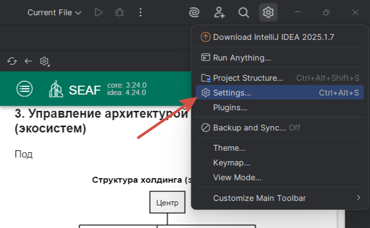
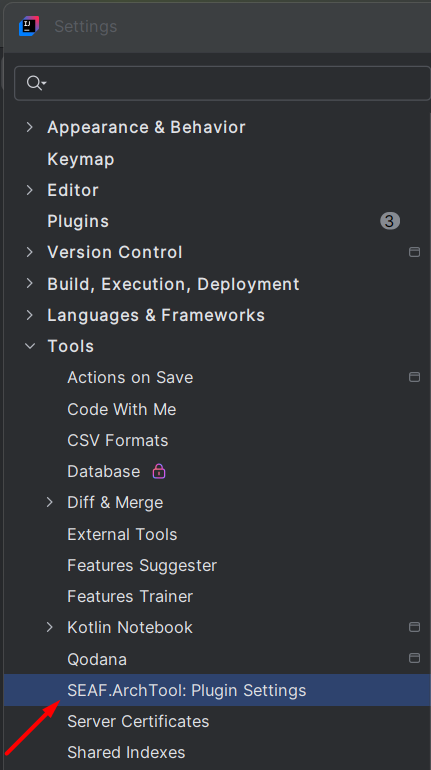
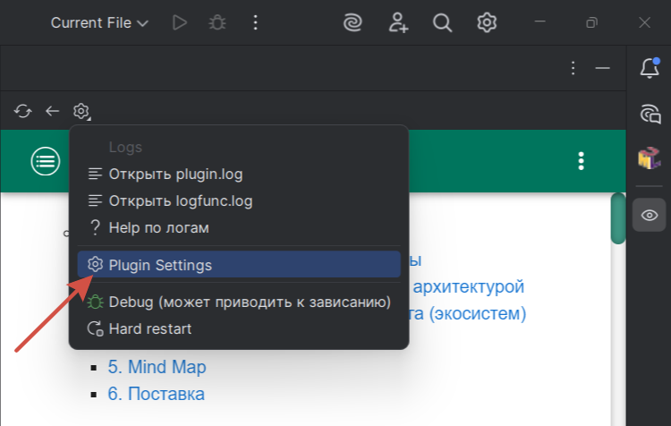
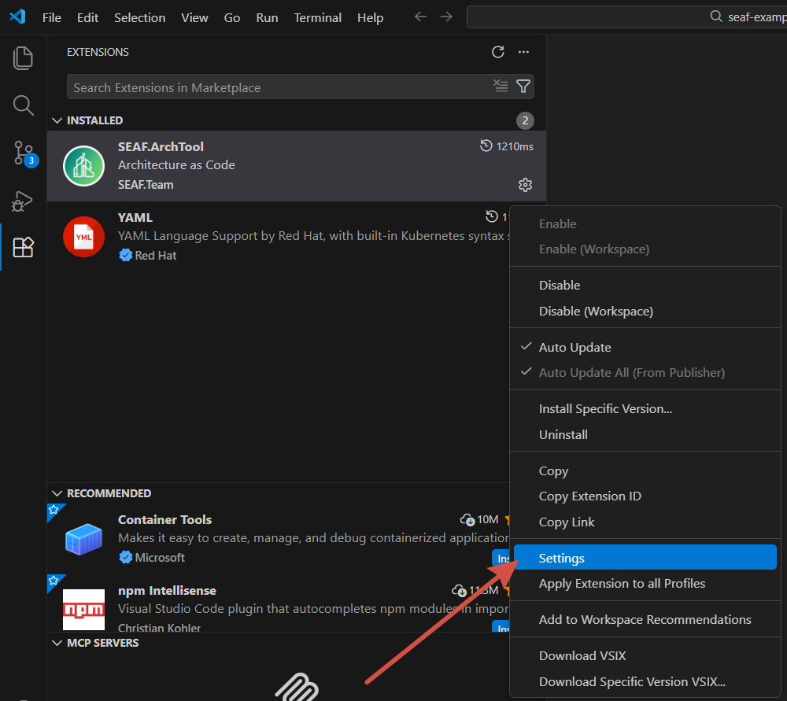

# Настройки плагина

Настройки плагина - это набор параметров, которые определяют его поведение в вашей среде разработки. С их помощью вы можете включать и отключать функции и задавать пути к ресурсам. В этом разделе рассматриваются параметры плагинов для JetBrains и VSCode. 

## Как попасть в настройки плагина

### JetBrains

IDE and Project Settings -> Settings -> Tools -> SEAF.ArchTool: Plugin Settings

или

Plugin Tools -> Plugin Settings

### VSCode

Extensions -> SEAF.ArchTool -> Manage -> Settings

## Параметры

### Enterprise mode

Enterprise mode позволяет плагину автоматически подгружать ядро инструмента и метамодель с портала. Достаточно указать ссылку на портал - и все необходимые параметры будут применены без дополнительной ручной настройки. При этом часть настроек становится недоступной в настройках плагина, так как их конфигурация централизована через портал.

Названия параметров в плагине:

JetBrains
* Using mode - включение / выключение Enterprise mode
* Enterprise portal - ссылка на портал, данный параметр появляется после выбора Enterprise в Using mode

VSCode
* Is Enterprise Mode - включение / выключение Enterprise mode
* Enterprise Server - ссылка на портал

⚠️ На данный момент Enterprise mode присутствует в плагинах, но официально не поддерживается и не тестируется. 

### External rendering

External rendering позволяет использовать внешний сервер для рендеринга диаграмм PlantUML. В этом режиме плагин отправляет запросы на указанный сервер вместо выполнения рендеринга локально.

Названия параметров в плагине:

JetBrains
* External rendering - включение / выключение External rendering
* Render server - ссылка на сервер рендеринга, данный параметр появляется после включения External rendering
* Request type - тип запроса, используемый для отправки задачи на рендеринг, данный параметр появляется после включения External rendering

VSCode 
* Plantuml Render server - ссылка на сервер рендеринга
* Plantuml Request type - тип запроса, используемый для отправки задачи на рендеринг
* Plantuml Mode - выбор библиотеки, которая будет использована для рендеринга (⚠️ На данный момент эта настройка не работает)

### Git

Плагин поддерживает импорт данных из удаленных репозиториев непосредственно в коде. При импорте указывается тип системы контроля версий и путь к ресурсу (bitbucket:arch:berezka:root.yaml).
Для работы таких импортов необходимо настроить параметры подключения в разделе Git.
Плагин обрабатывает импорты только для той системы контроля версий, которая указана в этих настройках.
Плагин JetBrains поддерживает работу с Bitbucket (API v1, v2) и Gitlab.
⚠️ На данный момент настройки Git присутствуют в плагине VSCode, но этот функционал не работает.

Названия параметров в плагине:

JetBrains 
* Git server vendor (Bitbucket / Gitlab) - тип системы контроля версий 
* Git server - адрес сервера системы контроля версий, на котором размещены репозитории
* Git personal token - персональный токен доступа, используемый для аутентификации при обращении к серверу СКВ
* Bitbucket mode - версия API Bitbucket, данный параметр отображается при выборе значения Bitbucket в параметре Git server vendor

### GigaChat

Эта группа параметров позволяет переопределить значения соответствующих переменных окружения для интеграции с GigaChat.
Подробнее про GigaChat и его настройку можно прочитать в разделе [GigaChat](/entities/docs/blank?dh-doc-id=archtool.plugins.gigachat.menu). 

* GIGACHAT token - токен доступа для авторизации запросов к API
* GIGACHAT scope - версия API GigaChat
* GIGACHAT mode - режим работы GigaChat (Bank network - работа осуществляется в сети Банка / External network - работа осуществляется во внешней сети)
* GIGACHAT auth url - URL для получения токена доступа для авторизации запросов к API

_Данная группа параметров доступна только для плагина JetBrains_

### S3

Параметр S3 service url предназначен для указания адреса сервиса, который используется для работы с файловым хранилищем.

_Данный параметр доступен только для плагина JetBrains_

### ENV 

Параметр ENV предназначен для переопределения значения переменных окружения. На текущий момент поддерживает только переопределение конфигурации ClickStream.

_Данный параметр доступен только для плагина JetBrains_

### Logging

Эта группа параметров управляет поведением логирования в плагине. 

* Logging level - позволяет настроить уровень логирования. По умолчанию INFO
* Log dir in project - позволяет разместить директорию с файлами логов в проекте. Важно: в случае размещения директории в проекте не забудьте включить ее в gitignore
* Enable jsonata $log func - позволяет включить запись логов выполнения JSONata запросов ($log)

_Данная группа параметров доступна только для плагина JetBrains_

### Meta

Параметр Using meta позволяет включить интеграцию с Meta (только для сотрудников Банка).

_Данный параметр доступен только для плагина JetBrains_

### Cache mode

Параметр Cache mode включает или отключает использование кеширования при работе плагина. Кеш позволяет повторно использовать ранее полученные данные и может применяться для оптимизации работы в зависимости от сценария использования. 

Названия параметра в плагине:

JetBrains
* Cache mode

VSCode
* Is Cache Mode

### Plugin Version

Параметр Plugin Version содержит информацию о версии установленного плагина

_Данный параметр доступен только для плагина VSCode_

